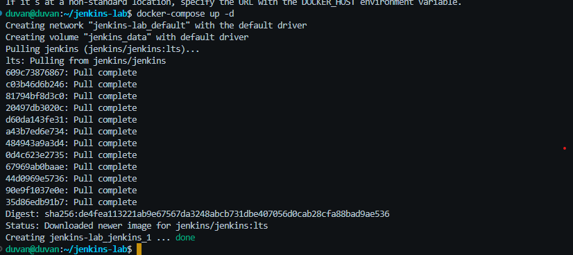
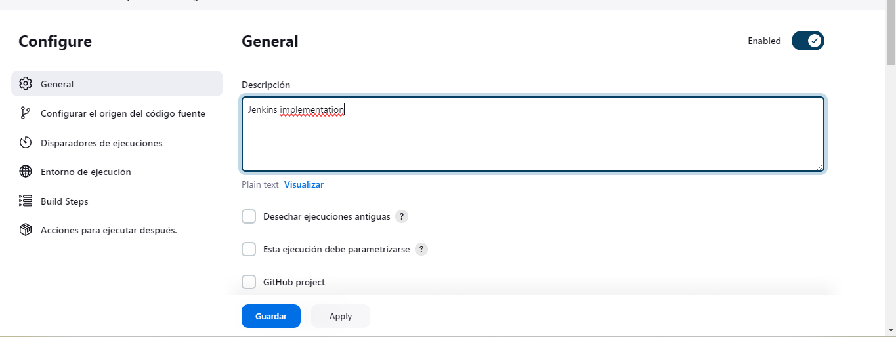

# Jenkins Lab

## Ejecutar Docker Compose

Para ejecutar Docker Compose, asegúrate de que tengas Docker Compose instalado en tu sistema. Luego, sigue estos pasos:

1. Navega a la ubicación donde se encuentra tu archivo `docker-compose.yml`.

    Asegúrate de que el archivo docker-compose.yml tenga las siguientes especificaciones:
    ```yaml
    version: '3.7'

    services:
      jenkins:
        image: jenkins/jenkins:lts
        ports:
          - "8080:8080"
          - "3000:3000"
        volumes:
          - jenkins_data:/var/jenkins_home

    volumes:
      jenkins_data:
        name: jenkins_data
    ```
    

2. Ejecuta el siguiente comando en tu terminal para iniciar los contenedores definidos en el archivo `docker-compose.yml`:

```bash
docker-compose up -d
```


3. Extraer passwords

```bash
docker logs id_container
```

```bash
docker exec id_container cat /var/jenkins_home/secrets/initialAdminPassword
```


## Iniciar configuración Jenkins
1. Ingresa a la página de Jenkins utilizando la URL localhost:8080 en tu navegador.
2. Utiliza la contraseña extraída anteriormente para iniciar sesión como administrador.

3. Selecciona el tipo de instalación de Jenkins según tus preferencias.
4. Elige Node.js en la lista de plugins a instalar y sigue las instrucciones para completar la instalación.

5. Crea un usuario administrador para futuros ingresos.


## Configurar proyecto en Jenkins
1. En la página inicial de Jenkins, selecciona "Nuevo Item" para crear un nuevo proyecto.

2. Asigna un nombre y selecciona el tipo de proyecto (freestyle project).
3. Configura la fuente del código como Git y proporciona la URL del repositorio de GitHub.
4. Asegúrate de configurar las ramas correctas para construir el proyecto.
5. En "Entorno de Compilación", selecciona proporcionar node & npm bin/ a la carpeta PATH.

6. Agrega un nuevo paso de compilación y ejecuta los comandos necesarios para tu proyecto.

7. Guarda la configuración.

## Ejecutar el proyecto
1. En la página principal de Jenkins, ejecuta manualmente el proyecto que acabas de crear.
2. Verifica la consola del proyecto para posibles errores durante la compilación.

3. Si todo está correcto, accede a la aplicación utilizando la URL localhost:3000.

4. Verifica que la aplicación esté funcionando correctamente accediendo a la IP del servidor.
